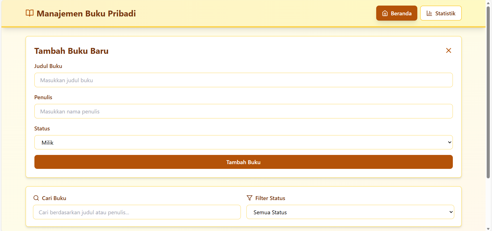

# 📚 Aplikasi Manajemen Buku Pribadi

**Tugas Praktikum UTS - Pemrograman Web**

---

## 👨‍💻 Identitas Mahasiswa

- **Nama**: [Andini Rahma Kemala]
- **NIM**: [123140067]
- **Kelas**: [Praktikum_Pemweb_RB]
- **Mata Kuliah**: Pemrograman Web


---

## 📝 Deskripsi Aplikasi

Aplikasi Manajemen Buku Pribadi adalah aplikasi web berbasis React yang dirancang untuk membantu pengguna mengelola dan melacak koleksi buku pribadi mereka. Aplikasi ini menyediakan fitur lengkap untuk mencatat buku yang dimiliki, sedang dibaca, dan ingin dibeli dengan antarmuka yang intuitif dan modern.

**Fitur Utama:**
- Manajemen buku (Tambah, Edit, Hapus)
- Pencarian buku berdasarkan judul atau penulis
- Filter buku berdasarkan status (Milik, Sedang Dibaca, Ingin Dibeli)
- Visualisasi statistik koleksi buku
- Penyimpanan data lokal menggunakan localStorage
- Desain responsif dengan tema warna coklat susu

---

## 🚀 Instruksi Instalasi dan Menjalankan

### Prasyarat
- Node.js (versi 14.x atau lebih baru)
- npm (Node Package Manager)

### Langkah Instalasi

**1. Download atau Clone Project**
```bash
# Extract file ZIP atau clone repository
cd manajemen-buku-pribadi
```

**2. Install Dependencies**
```bash
npm install
```

**3. Jalankan Aplikasi**
```bash
npm start
```

**4. Akses Aplikasi**

Buka browser dan akses:
```
http://localhost:3000
```

### Perintah Tambahan

```bash
# Menjalankan test
npm test

# Build untuk production
npm run build
```

---

## 📸 Screenshot Antarmuka

### 1. Halaman Beranda
)())

Menampilkan form tambah buku, pencarian, filter, dan daftar buku dalam bentuk card.

### 2. Halaman Statistik
)

Menampilkan visualisasi statistik koleksi buku dengan progress bar dan persentase.

### 3. Mode Edit Buku
)

Menampilkan form edit yang sudah terisi dengan data buku yang dipilih.

---

## 🎯 Penjelasan Fitur React yang Digunakan

### 1. React Hooks

#### useState
Digunakan untuk mengelola state lokal komponen.

```javascript
// Contoh di BookForm
const [formData, setFormData] = useState({
  judul: '',
  penulis: '',
  status: 'milik'
});

// Contoh di App
const [currentPage, setCurrentPage] = useState('home');
const [editingBook, setEditingBook] = useState(null);
```

#### useEffect
Digunakan untuk side effects seperti mengupdate data.

```javascript
// Auto-fill form saat mode edit
useEffect(() => {
  if (bookToEdit) {
    setFormData({
      judul: bookToEdit.judul,
      penulis: bookToEdit.penulis,
      status: bookToEdit.status
    });
  }
}, [bookToEdit]);
```

#### useContext
Digunakan untuk mengakses Context API.

```javascript
const useBooks = () => {
  const context = useContext(BookContext);
  if (!context) {
    throw new Error('useBooks must be used within BookProvider');
  }
  return context;
};
```

### 2. Custom Hooks

#### useLocalStorage
**Lokasi:** `src/hooks/useLocalStorage.js`

Hook untuk mengelola penyimpanan data di localStorage.

```javascript
const useLocalStorage = (key, initialValue) => {
  // Membaca dari localStorage
  const [storedValue, setStoredValue] = useState(() => {
    try {
      const item = window.localStorage.getItem(key);
      return item ? JSON.parse(item) : initialValue;
    } catch (error) {
      console.error('Error loading from localStorage:', error);
      return initialValue;
    }
  });

  // Menyimpan ke localStorage
  const setValue = (value) => {
    try {
      const valueToStore = value instanceof Function ? value(storedValue) : value;
      setStoredValue(valueToStore);
      window.localStorage.setItem(key, JSON.stringify(valueToStore));
    } catch (error) {
      console.error('Error saving to localStorage:', error);
    }
  };

  return [storedValue, setValue];
};
```

#### useBookStats
**Lokasi:** `src/hooks/useBookStats.js`

Hook untuk menghitung statistik buku secara otomatis.

```javascript
const useBookStats = (books) => {
  const [stats, setStats] = useState({
    total: 0,
    milik: 0,
    baca: 0,
    beli: 0
  });

  useEffect(() => {
    const newStats = {
      total: books.length,
      milik: books.filter(b => b.status === 'milik').length,
      baca: books.filter(b => b.status === 'baca').length,
      beli: books.filter(b => b.status === 'beli').length
    };
    setStats(newStats);
  }, [books]);

  return stats;
};
```

### 3. Context API

**Lokasi:** `src/context/BookContext.jsx`

Digunakan untuk state management global.

```javascript
// Membuat Context
const BookContext = createContext();

// Provider Component
const BookProvider = ({ children }) => {
  const [books, setBooks] = useLocalStorage('books', []);
  const [searchQuery, setSearchQuery] = useState('');
  const [filterStatus, setFilterStatus] = useState('all');

  // Methods CRUD
  const addBook = (book) => {
    const newBook = {
      ...book,
      id: Date.now().toString(),
      createdAt: new Date().toISOString()
    };
    setBooks([...books, newBook]);
  };

  const updateBook = (id, updatedBook) => {
    setBooks(books.map(book => 
      book.id === id ? { ...book, ...updatedBook } : book
    ));
  };

  const deleteBook = (id) => {
    setBooks(books.filter(book => book.id !== id));
  };

  const getFilteredBooks = () => {
    let filtered = books;

    if (filterStatus !== 'all') {
      filtered = filtered.filter(book => book.status === filterStatus);
    }

    if (searchQuery) {
      filtered = filtered.filter(book =>
        book.judul.toLowerCase().includes(searchQuery.toLowerCase()) ||
        book.penulis.toLowerCase().includes(searchQuery.toLowerCase())
      );
    }

    return filtered;
  };

  return (
    <BookContext.Provider value={{
      books,
      addBook,
      updateBook,
      deleteBook,
      getFilteredBooks,
      searchQuery,
      setSearchQuery,
      filterStatus,
      setFilterStatus
    }}>
      {children}
    </BookContext.Provider>
  );
};
```

### 4. Komponen Reusable

#### BookForm
**Lokasi:** `src/components/BookForm/`

Komponen form untuk tambah dan edit buku dengan validasi.

#### BookList
**Lokasi:** `src/components/BookList/`

Komponen untuk menampilkan daftar buku dalam grid layout.

#### BookFilter
**Lokasi:** `src/components/BookFilter/`

Komponen untuk pencarian dan filter buku.

#### Stats
**Lokasi:** `src/pages/Stats/`

Komponen untuk visualisasi statistik dengan progress bar.

### 5. localStorage

Digunakan untuk menyimpan data buku secara persistent.

```javascript
// Simpan data
window.localStorage.setItem('books', JSON.stringify(data));

// Baca data
const data = JSON.parse(window.localStorage.getItem('books'));
```

---


## 🧪 Laporan Testing (Screenshots Hasil Test)

### Menjalankan Test
```bash
npm test
```

### Hasil Test


### Test Coverage

**1. Render Aplikasi**
- Memastikan aplikasi dapat dirender tanpa error
- Memeriksa keberadaan elemen utama

**2. Fungsi Tombol**
- Memastikan tombol "Tambah Buku Baru" muncul
- Memastikan form muncul setelah tombol diklik

**3. Validasi Form**
- Memastikan error muncul jika form kosong
- Memastikan error muncul jika input < 3 karakter

**4. Tambah Buku**
- Memastikan buku berhasil ditambahkan
- Memastikan buku muncul di daftar

**5. Navigasi**
- Memastikan navigasi Beranda ↔ Statistik berfungsi
- Memastikan halaman berganti dengan benar

**6. Filter**
- Memastikan filter status berfungsi
- Memastikan hanya buku dengan status tertentu yang muncul

---

